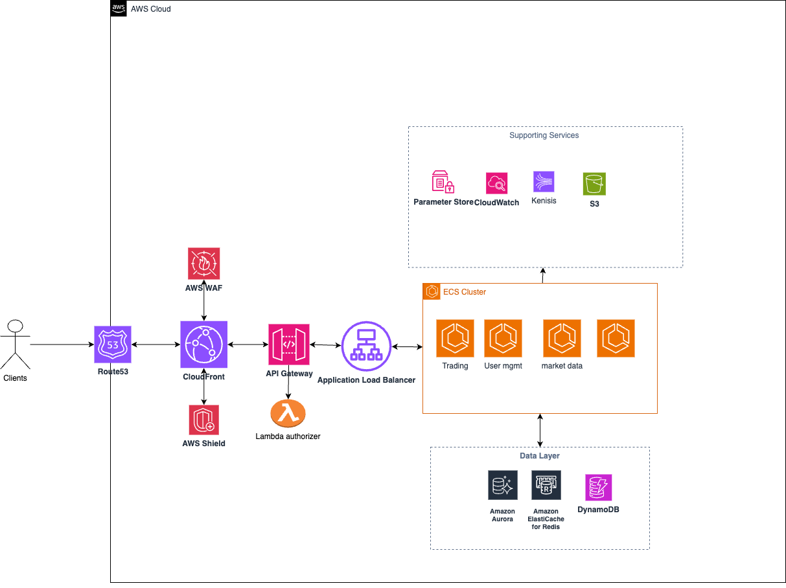

# High-Availability Trading System Architecture
## Executive Summary
This document outlines the architecture for a highly available trading system similar to Binance, designed to handle 500 RPS with p99 response times under 100ms. The system prioritizes fault tolerance, scalability, and cost-effectiveness while leveraging AWS cloud services.

## Core Features Selected
Given time constraints, I've focused on essential trading platform features that best demonstrate cloud infrastructure mastery:

- Real-time Market Data Streaming - WebSocket connections for live price feeds
- Order Management System - Place, cancel, and modify orders
- User Account Management - Authentication, balance tracking, portfolio management
- Trade Execution Engine - Order matching and trade settlement
- Historical Data & Analytics - Price charts, trade history, account statements

## System Architecture Overview
### High-Level Architecture Diagram

Core Services and Justification
### 1. Amazon ECS with Fargate
Role: Container orchestration for microservices
Why Chosen:

- Serverless container management eliminates infrastructure overhead
- Auto-scaling based on CPU/memory metrics
- Integrated with ALB for service discovery
- Better cost control than EKS for this scale

Alternatives Considered:
- EKS: More complex, higher overhead for 500 RPS
- EC2: Requires manual scaling and maintenance

### 2. Application Load Balancer (ALB)
Role: Traffic distribution and SSL termination
Why Chosen:

- Layer 7 load balancing with advanced routing
- WebSocket support for real-time connections
- Health checks and auto-scaling integration
- Cross-AZ redundancy

Alternatives Considered:

- Network Load Balancer: Layer 4 only, less flexible routing

### 3. Amazon API Gateway
Role: API management, authentication, and rate limiting
Why Chosen:

- Built-in rate limiting (500 RPS requirement)
- JWT/OAuth integration
- Request/response transformation
- Monitoring and analytics

Alternatives Considered:

- Direct ALB: No rate limiting or API management features
- Kong/Nginx: Additional infrastructure to manage

### 4. Amazon RDS Aurora (PostgreSQL)
Role: Primary transactional database
Why Chosen:

- Multi-AZ automatic failover (<30 seconds)
- Read replicas for scaling reads
- ACID compliance for financial transactions
- Automated backups and point-in-time recovery

Alternatives Considered:

- DynamoDB: Eventually consistent, complex for financial data
- RDS MySQL: Less advanced than Aurora for HA

### 5. Amazon ElastiCache (Redis)
Role: Session storage, real-time data caching
Why Chosen:

- Sub-millisecond latency for frequently accessed data
- Pub/Sub for real-time market data distribution
- Automatic failover with Redis Cluster
- Persistent storage for session data

Alternatives Considered:

- Memcached: No persistence or pub/sub capabilities
- In-memory storage: Not scalable across instances

### 6. Amazon DynamoDB
Role: High-throughput operations (order books, trade history)
Why Chosen:

- Single-digit millisecond response times
- Auto-scaling based on demand
- Global secondary indexes for flexible queries
- Event-driven architecture with DynamoDB Streams

Alternatives Considered:

- DocumentDB: MongoDB compatibility but higher latency
- TimeStream: Optimized for time-series but less flexible

### 7. Amazon Kinesis Data Streams
Role: Real-time data streaming and event processing
Why Chosen:

- Real-time processing of trade events
- Durable storage of streaming data
- Integration with Lambda for event processing
- Scales to handle market data feeds

Alternatives Considered:

- SQS: Not suitable for streaming use cases
- Kafka on EC2: Additional infrastructure complexity

### 8. AWS Lambda
Role: Event-driven processing and background tasks
Why Chosen:

- Serverless execution for sporadic tasks
- Automatic scaling to zero
- Event triggers from DynamoDB, Kinesis, S3
- Cost-effective for variable workloads

Alternatives Considered:

- ECS Tasks: Overkill for simple event processing
- EC2 Workers: Manual scaling and management

## Microservices Architecture
### 1. Trading Engine Service

- Technology: Node.js/TypeScript on ECS Fargate
- Database: DynamoDB for order books, RDS for trade records
- Responsibilities: Order matching, trade execution, risk management
- Scaling: Horizontal scaling based on order volume

### 2. User Management Service

- Technology: Java Spring Boot on ECS Fargate
- Database: RDS Aurora (user profiles, KYC data)
- Cache: ElastiCache for session management
- Responsibilities: Authentication, authorization, account management

### 3. Market Data Service

- Technology: Go on ECS Fargate
- Database: DynamoDB for real-time prices, S3 for historical data
- Streaming: Kinesis for real-time data distribution
- Responsibilities: Price aggregation, market data distribution

### 4. WebSocket Service

- Technology: Node.js with Socket.io on ECS Fargate
- Cache: ElastiCache Redis for connection state
- Responsibilities: Real-time client connections, push notifications

### 5. REST API Service

- Technology: Python FastAPI on ECS Fargate
- Database: Multi-database access layer
- Responsibilities: CRUD operations, portfolio management

## High Availability Strategy
### Multi-AZ Deployment

- All services deployed across 3 Availability Zones
- RDS Aurora with cross-AZ read replicas
- ElastiCache Redis with automatic failover
- ECS tasks distributed across AZs

### Fault Tolerance Mechanisms

- Circuit Breakers: Prevent cascade failures
- Retry Logic: Exponential backoff for transient failures
- Graceful Degradation: Continue core functions during partial outages
- Health Checks: ALB and ECS health monitoring
- Database Failover: Aurora automatic failover in <30 seconds

### Monitoring and Alerting

- CloudWatch: Application and infrastructure metrics
- X-Ray: Distributed tracing for latency analysis
- CloudWatch Alarms: Automated scaling triggers
- SNS: Critical alert notifications

## Performance Optimization
### Latency Reduction (<100ms p99)

- CDN Caching: CloudFront for static assets and API responses
- Redis Caching: Sub-millisecond data retrieval
- Connection Pooling: Database connection optimization
- Async Processing: Non-blocking I/O operations
- Regional Deployment: Services close to users

### Throughput Optimization (500 RPS)

- Auto Scaling: ECS and database read replicas
- Load Balancing: Request distribution across instances
- Horizontal Scaling: Stateless service design
- Database Optimization: Proper indexing and query optimization

## Security Architecture
### Authentication & Authorization

- AWS Cognito: User identity management
- JWT Tokens: Stateless authentication
- API Gateway: Request validation and rate limiting
- IAM Roles: Service-to-service authentication

## Data Protection

- Encryption in Transit: TLS 1.3 for all communications
- Encryption at Rest: AWS KMS for database and storage
- VPC: Network isolation and security groups
- WAF: Web application firewall protection

## Cost Optimization
### Current Setup Cost Estimation (Monthly)

- ECS Fargate: ~$400 (10 services, 2 vCPU each)
- RDS Aurora: ~$300 (db.r5.large with 2 read replicas)
- ElastiCache: ~$150 (cache.r5.large cluster)
- DynamoDB: ~$200 (provisioned capacity)
- ALB + API Gateway: ~$100
- Other Services: ~$150
- Total: ~$1,300/month

### Cost Optimization Strategies

- Reserved Instances: 30-40% savings on predictable workloads
- Spot Instances: For non-critical background processing
- Auto Scaling: Scale down during low-traffic periods
- S3 Intelligent Tiering: Optimize storage costs
- CloudWatch: Monitor and optimize unused resources

# Conclusion
This architecture provides a robust foundation for a trading platform that meets the specified requirements while maintaining cost-effectiveness and scalability. The design emphasizes:

- High Availability: Multi-AZ deployment with automatic failover
- Performance: Sub-100ms response times with intelligent caching
- Scalability: Horizontal scaling capabilities for future growth
- Security: Comprehensive security measures for financial data
- Cost Efficiency: Optimized resource utilization with clear scaling path

The modular microservices architecture allows for independent scaling and development while maintaining system resilience and performance requirements.